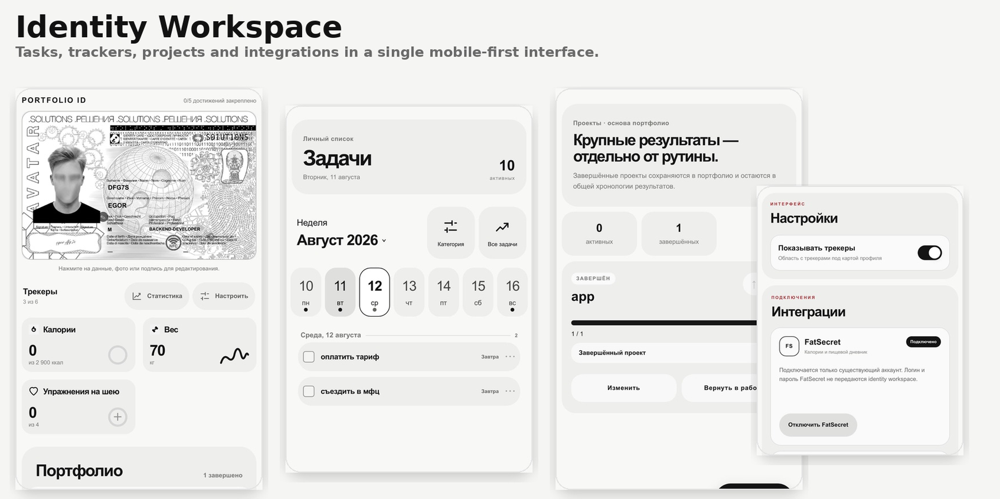

# Identity Workspace

Identity Workspace — mobile-first приложение для личной продуктивности, разработанное на Go, PostgreSQL, React и TypeScript. В одном PWA-ориентированном интерфейсе оно объединяет планирование задач, управление проектами, персональные показатели и портфолио в формате идентификационной карточки.

Этот репозиторий представляет собой очищенную портфолио-версию рабочего приложения. Он содержит полный исходный код, миграции, клиенты внешних интеграций и тесты, но не включает приватную конфигурацию развёртывания, пользовательские данные и production credentials.

## Скриншоты



## Возможности

- Mobile-first календарь задач с датами, необязательным временем, приоритетами, категориями, напоминаниями, отдельным блоком просроченных задач и отменой завершения.
- Проекты с прогрессом, ручной сортировкой, связанными задачами, историей завершения и закреплением результатов в портфолио.
- Встроенные трекеры калорий, воды и веса, а также настраиваемые пользовательские трекеры.
- Дневная история и графики трекеров, напоминания и быстрые действия для изменения прогресса.
- Редактируемая идентификационная карточка с данными профиля, обработанной чёрно-белой фотографией и подписью, которую можно нарисовать касанием.
- Интеграция TickTick по OAuth 2.0 с двусторонней синхронизацией задач.
- Трёхэтапная OAuth 1.0-интеграция FatSecret с существующим дневником питания.
- PWA manifest, Service Worker и Web Push-уведомления для задач и трекеров.
- Закрытая система аккаунтов с изоляцией данных по пользователям; публичная регистрация намеренно отсутствует.

Service Worker обрабатывает push-уведомления и переходы из них. Данные приложения не кэшируются для автономной работы, поэтому API и PostgreSQL должны оставаться доступными.

## Технологии

- Backend: Go с языковой базой 1.22, стандартный `net/http`, `lib/pq`
- База данных: PostgreSQL 16 со встроенными SQL-миграциями
- Frontend: React 18, TypeScript 5, Vite 5
- Среда выполнения: многоэтапная Docker-сборка и Docker Compose
- Возможности браузера: PWA manifest, Service Worker, Push API и Pointer Events

## Архитектура

Backend построен по принципам прагматичной чистой архитектуры:

- `domain` определяет сущности и ошибки уровня приложения;
- `application` содержит сценарии использования, валидацию и интерфейсы инфраструктуры;
- `infrastructure` реализует PostgreSQL-репозитории, OAuth-клиенты и Web Push;
- `transport/httpapi` отвечает за маршрутизацию, JSON, cookies и HTTP-защиту;
- `cmd/server` загружает конфигурацию и собирает приложение.

React-приложение компилируется в статические файлы, которые раздаёт Go-процесс. Благодаря этому браузерный интерфейс и API работают на одном origin. Потоки запросов, интеграций и уведомлений подробнее описаны в [`docs/ARCHITECTURE.md`](docs/ARCHITECTURE.md).

## Структура проекта

```text
.
├── backend/
│   ├── cmd/server/
│   └── internal/
│       ├── application/
│       ├── domain/
│       ├── infrastructure/
│       │   └── postgres/migrations/
│       └── transport/httpapi/
├── frontend/
│   ├── public/
│   └── src/
├── docs/
├── Dockerfile
├── docker-compose.yml
└── Makefile
```

## Безопасность

Реализованные механизмы защиты:

- хеширование паролей PBKDF2-HMAC-SHA256 с 600 000 итераций;
- случайные токены сессий — в PostgreSQL хранятся только их SHA-256-хеши;
- cookies с `HttpOnly`, `SameSite=Lax` и защищённые cookies с префиксом `__Host-` при работе через HTTPS;
- ограничение частоты входа по IP и логину, а также ограничение числа одновременных проверок пароля;
- CSRF-защита через проверку same-origin, Fetch Metadata и обязательный пользовательский заголовок;
- проверка CORS и Host в production, CSP и другие защитные HTTP-заголовки;
- изоляция запросов репозитория по аутентифицированному `user_id` из контекста запроса;
- опциональное шифрование сохранённых OAuth credentials алгоритмом AES-256-GCM с контекстно-зависимыми associated data;
- запуск контейнера от непривилегированного UID 10001, read-only файловая система, сброшенные capabilities и `no-new-privileges`;
- контрольные суммы миграций и advisory lock PostgreSQL при обновлении схемы.

Включённый аккаунт `demo` предназначен только для локальной разработки. Production-режим не запускается, пока пароль активного bootstrap-аккаунта не будет заменён. Дополнительная информация находится в [`SECURITY.md`](SECURITY.md).

## Интеграции

### TickTick

TickTick подключается по OAuth 2.0 с правами `tasks:read` и `tasks:write`. Токены остаются на backend и в базе данных и никогда не передаются браузеру. Пока аутентифицированная страница видима, frontend сразу запускает синхронизацию, а следующий цикл планирует через 30 секунд после завершения предыдущего. Backend сначала повторяет ожидающие локальные изменения, затем транзакционно применяет актуальный набор открытых задач провайдера.

Для использования интеграции зарегистрируйте собственное OAuth-приложение TickTick и укажите локальный callback:

```text
http://localhost:8080/api/integrations/ticktick/callback
```

### FatSecret

FatSecret использует подписанные запросы трёхэтапного OAuth 1.0 и подключается только к существующему аккаунту. Приложение не запрашивает credentials пользователя FatSecret и не создаёт новые профили. Данные о питании запрашиваются у провайдера и не сохраняются в виде локального дневника питания.

Для использования интеграции зарегистрируйте собственное приложение FatSecret и укажите локальный callback:

```text
http://localhost:8080/api/integrations/fatsecret/callback
```

Если соответствующие credentials приложения не заполнены, OAuth-интеграция остаётся отключённой.

## Локальная разработка

Требования: Docker Engine и плагин Docker Compose.

```bash
git clone <url-публичного-репозитория>
cd identity-workspace
cp .env.example .env
docker compose up --build
```

Откройте <http://localhost:8080> и используйте development-only аккаунт:

```text
логин: demo
пароль: identity-workspace-demo
```

При первом запуске будет создан PostgreSQL volume и применены все миграции. Остановить foreground-процесс можно сочетанием `Ctrl+C`. Чтобы удалить контейнеры, сохранив данные базы, выполните:

```bash
docker compose down
```

Аналогичные сокращённые команды доступны через Makefile:

```bash
make dev
make logs
make down
```

## Конфигурация

`.env.example` содержит только локальные шаблоны и документированные development-значения. Основные параметры:

| Переменная | Назначение |
| --- | --- |
| `DATABASE_URL` | Строка подключения Go-процесса к PostgreSQL |
| `PLAYER_TZ` | Часовой пояс календаря и напоминаний |
| `PUBLIC_URL` | Канонический origin, доступный браузеру |
| `CORS_ORIGIN` | Origin, которому API разрешает браузерные запросы |
| `DATA_ENCRYPTION_KEY` | 32-байтный AES-ключ в Base64 для OAuth-данных и производной Web Push identity |
| `VAPID_PRIVATE_KEY` | Необязательный явно заданный приватный VAPID-ключ |
| `*_CLIENT_ID`, `*_CLIENT_SECRET` | Credentials собственных OAuth-приложений разработчика |
| `*_CALLBACK_URL` | Точный OAuth callback, зарегистрированный у соответствующего провайдера |

Перед подключением реального OAuth-аккаунта или включением Web Push создайте стабильный локальный ключ шифрования:

```bash
openssl rand -base64 32
```

Сохраните результат в `DATA_ENCRYPTION_KEY` внутри неотслеживаемого файла `.env`. Не меняйте это значение после появления зашифрованных токенов или производных Web Push-подписок без отдельной миграции данных.

Универсальный production overlay демонстрирует использование файловых Docker secrets. Он ожидает файлы внутри неотслеживаемой директории `secrets/`; их имена и эксплуатационные ограничения описаны в самом overlay-файле. Это пример архитектуры развёртывания, а не готовая production-конфигурация.

## Миграции базы данных

Миграции находятся в `backend/internal/infrastructure/postgres/migrations/` и встраиваются в backend-бинарник через `go:embed`. При запуске механизм миграций:

1. получает advisory lock PostgreSQL;
2. проверяет SHA-256-сумму каждой ранее применённой миграции;
3. транзакционно применяет новые миграции;
4. сохраняет имя файла и контрольную сумму в `schema_migrations`.

В портфолио-версии приватный bootstrap фиксированных аккаунтов заменён миграцией `013_development_demo_account.sql`. Она содержит только описанный выше development-аккаунт и не включает приватные хеши паролей.

## Тестирование

Для запуска проверок локального toolchain выполните:

```bash
make test
```

Команда проверяет форматирование Go, запускает unit-тесты и race detector, выполняет `go vet`, собирает Go-приложение, компилирует TypeScript и создаёт production-сборку Vite. Эквивалентный production многоэтапный образ можно проверить командами:

```bash
make test-docker
docker compose config --quiet
```

## Заметки о production

Локальный Compose-файл привязывает приложение к `127.0.0.1`. Для реального развёртывания необходимо настроить завершение HTTPS, создать уникальные файловые secrets, заменить или отключить demo-аккаунт, явно применять миграции, настроить резервное копирование PostgreSQL и ограничить прямой доступ к порту приложения.

Публичный репозиторий не содержит специфичных для конкретного сервера reverse proxy, firewall, автоматизации сертификатов, SSH-процесса или путей резервного копирования.

## Статус проекта

Identity Workspace — активно развиваемый персональный портфолио-проект. Репозиторий опубликован для изучения кода и технической оценки; это не публичный многопользовательский сервис, и открытая регистрация в нём отсутствует.
