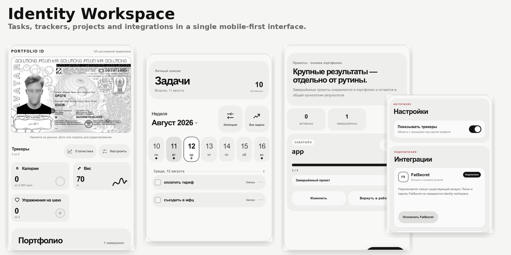
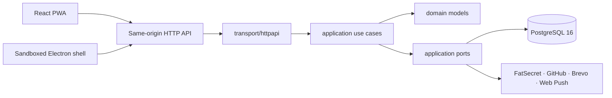

# Identity Workspace

<p align="center">
  <strong>A personal operating system for focus, health, projects and identity.</strong><br>
  One production-shaped workspace, built end to end with Go, PostgreSQL, React and TypeScript.
</p>

<p align="center">
  <a href="https://github.com/woka00/identity-workspace-pub/actions/workflows/quality.yml"></a>
  
  
  
  
  
  
</p>



Identity Workspace started as a personal productivity tool and grew into a compact product platform: a mobile-first PWA, a collaborative project space, a time and nutrition tracker, a portfolio identity card, an operations toolkit and a hardened Electron client. It is not a UI concept or a CRUD tutorial. The repository contains the application layers, database evolution, external integrations, security controls, release automation and recovery tooling needed to run the product.

The public repository mirrors the current product code while intentionally excluding production credentials, user data, backups and private infrastructure addresses.

## What makes it interesting

Most portfolio projects stop at the happy path. Identity Workspace includes the awkward, expensive parts that turn a demo into a system:

- server-authoritative state and per-user isolation across every persisted feature;
- transactional invariants for timers, shared work and account lifecycle;
- real OAuth, Web Push, email verification, barcode scanning and OCR flows;
- an indexed Russian food catalogue with private contributions and an admin review pipeline;
- responsive PWA and desktop surfaces sharing one backend and one product model;
- explicit production gates, migrations, backups, restore tooling, health checks and release manifests;
- architecture checks and focused test suites that defend boundaries instead of relying on convention.

## Product surface

| Area | What is implemented |
| --- | --- |
| **Personal identity** | Editable technical ID card, portrait treatment, touch signature, selected achievements and a chronological portfolio. |
| **Planning** | Calendar tasks, recurrence, categories, priority, manual ordering, overdue handling and device reminders. |
| **Focus** | Multi-activity timer with start, pause and finish flows; today/week views; day, week and month statistics. |
| **Health & habits** | Calories and macros, water, weight, custom trackers, reminders, trends and a GitHub contribution tracker. |
| **Nutrition** | Local food diary, Russian catalogue search, barcode aliases, camera scanning, label OCR, custom foods and FatSecret OAuth. |
| **Collaborative work** | Shared projects, invite links, members, sections, assignees, due dates, comments, files, links, notes and an activity timeline. |
| **Personalization** | Feature onboarding, configurable bottom navigation, light, black, Apple and scheduled themes. |
| **Delivery** | Installable PWA, sandboxed Electron shell, Docker images, Compose environments and cross-platform desktop builds. |

## Architecture

The codebase uses pragmatic clean architecture on both sides of the API. Business rules do not depend on HTTP, SQL or browser APIs; adapters point inward and are checked in CI-friendly scripts and Go tests.


```mermaid
flowchart LR
    PWA[React PWA] --> HTTP[Same-origin HTTP API]
    Desktop[Sandboxed Electron shell] --> HTTP
    HTTP --> Transport[transport/httpapi]
    Transport --> App[application use cases]
    App --> Domain[domain models]
    App --> Ports[application ports]
    Ports --> PG[(PostgreSQL 16)]
    Ports --> Integrations[FatSecret · GitHub · Brevo · Web Push]
```

### Backend

```text
cmd/server
  -> internal/transport/httpapi
  -> internal/application
  -> internal/domain

internal/infrastructure/* implements application ports
```

- Go standard library HTTP server with focused adapters instead of a framework-heavy core.
- PostgreSQL is the source of truth for profiles, planning, time, nutrition and collaborative work.
- Embedded, one-way SQL migrations evolve an existing installation without resetting its data.
- The time tracker combines a per-user advisory lock with a partial unique index, so only one active session can exist even under concurrent requests.
- Shared project entities use server-side authorization and version fields to reject stale edits.

### Frontend

```text
presentation (React)
  -> application (pure product rules)
  -> domain (API-independent models)
  -> infrastructure (HTTP, browser and export adapters)
```

- React 18 + TypeScript 5.9 + Vite 6, designed mobile-first and expanded for desktop work surfaces.
- Server data remains authoritative; local ticks, dialogs, filters and animation state stay presentation-only.
- PWA installation, Web Push, camera/barcode access and PDF export are isolated behind browser adapters.
- Architecture, theme, nutrition-goal and PWA contracts are executable checks under `frontend/scripts/`.

Detailed boundaries: [backend architecture](backend/ARCHITECTURE.md) · [frontend architecture](frontend/ARCHITECTURE.md) · [design system](DESIGN.md) · [UX contract](UX-CONTRACT.md)

## Engineering decisions worth opening in an interview

### A timer that stays correct

The browser advances the visible counter for smoothness, but PostgreSQL calculates persisted duration. Starting a new activity atomically closes the previous one. Statistics split sessions across calendar-day boundaries without double-counting the original session.

### Collaboration without a second product

The **Work** area extends the same identity and authorization model instead of bolting on a separate service. Project membership is resolved server-side; invitations expire; resources are scoped to the project; tasks, notes and project metadata carry versions for conflict detection.

### Nutrition with a data pipeline, not a hard-coded list

Food search combines a local PostgreSQL catalogue, user-created items, barcode links and optional FatSecret data. Catalogue import tools prepare Open Food Facts and retailer datasets. Private additions can be reviewed, edited, rejected or promoted to the shared community catalogue by an admin.

### Security as application behavior

- `HttpOnly` server sessions; only SHA-256 session hashes are persisted.
- Passwords use salted PBKDF2-HMAC-SHA256.
- Registration tokens are single-use hashes; verified email is encrypted with AES-256-GCM and indexed through a keyed HMAC.
- OAuth credentials are encrypted at rest and never sent to the browser.
- Production refuses preview database credentials, missing encryption material and unrotated preview passwords.
- Containers run read-only, without Linux capabilities, behind a loopback-bound application port.
- Electron enables sandboxing, disables Node integration, allowlists the workspace/OAuth origins and isolates native window controls in a local view.

See [SECURITY.md](SECURITY.md), the documented [historical security review](SECURITY_AUDIT_RU.md) and the [production deployment guide](PRODUCTION_DEPLOYMENT_RU.md).

## Run locally

Prerequisites: Docker with the Compose plugin.

```bash
git clone https://github.com/woka00/identity-workspace-pub.git
cd identity-workspace-pub
docker compose up -d --build
```

The app is available at [http://localhost:8080](http://localhost:8080). The development stack binds the port to loopback and stores PostgreSQL data in the `pgdata` volume.

Preview passwords are deliberately not published. Set a local password for `avatar01` after the first start:

```bash
docker compose exec \
  -e AVATAR_NEW_PASSWORD='choose-a-local-password-of-15+-characters' \
  app /app/avatar-id-server set-password avatar01
```

Then sign in as `avatar01`. Optional integrations stay disabled until their own credentials are configured in a local `.env`; the core product works without them.

### Run services separately

```bash
# PostgreSQL
docker compose up -d db

# backend
cd backend
go run ./cmd/server

# frontend, in another terminal
cd frontend
npm ci
npm run dev
```

Vite runs on `http://localhost:5173` and proxies `/api` to the backend on `:8080`. Available variables and safe development defaults are documented in [.env.example](.env.example).

## Verification

Fast local checks:

```bash
cd backend && go test ./...
cd ../frontend && npm ci && npm run build
cd ../desktop && npm ci && npm run check
```

Release-level verification:

```bash
make test       # Go format/tests/race/vet/build + frontend checks/build/audit
make security   # static security checks and available scanners
make manifest   # reproducible SHA-256 release inventory
```

Every push and pull request is gated by backend tests, race detection, formatting, vetting, frontend architecture and production builds, dependency audits, desktop tests, Compose validation and shell syntax checks. The project also ships production smoke tests, backup verification, staging DAST support and cross-platform desktop installer builds.

## Repository map

```text
backend/      Go domain, use cases, adapters, HTTP transport and migrations
frontend/     React/TypeScript PWA and browser integrations
desktop/      sandboxed Electron client for Linux, macOS and Windows
deploy/       backup, restore, security, verification and release scripts
docs/         registration and food-catalog operations
.github/      quality gates and cross-platform desktop installer builds
```

Operator documentation: [Makefile commands](MAKEFILE_RU.md) · [production deployment](PRODUCTION_DEPLOYMENT_RU.md) · [registration](docs/REGISTRATION_RU.md) · [food catalogue import](docs/FOOD_CATALOG_IMPORT_RU.md) · [desktop client](desktop/README.md)

## Deployment model

The provided production composition expects a reverse proxy to terminate TLS and keeps the application port on `127.0.0.1`. Secrets are file-mounted, migrations are explicit, PostgreSQL is not published, and production startup is blocked until the security preconditions pass.

```bash
make doctor
make check
make deploy
make status
```

The public repository does not contain a live production URL, credentials, `.env` files, database dumps or user content.

## Русское резюме

Identity Workspace — это не «ещё один todo-list», а полноценное личное рабочее пространство: задачи и повторения, таймер и статистика, питание и КБЖУ, трекеры воды/веса/GitHub, портфолио-визитка и совместные проекты с участниками, файлами, заметками и историей событий. Проект включает production-развёртывание, миграции, резервные копии, security gates, PWA и desktop-клиент. Основная техническая документация доступна по ссылкам выше; интерфейс продукта — русскоязычный.

## Status and license

The product is actively developed. This repository is source-available for portfolio review and technical evaluation. It is not an OSI open-source distribution; copying, modification, redistribution and commercial use require prior written permission. See [LICENSE](LICENSE).
